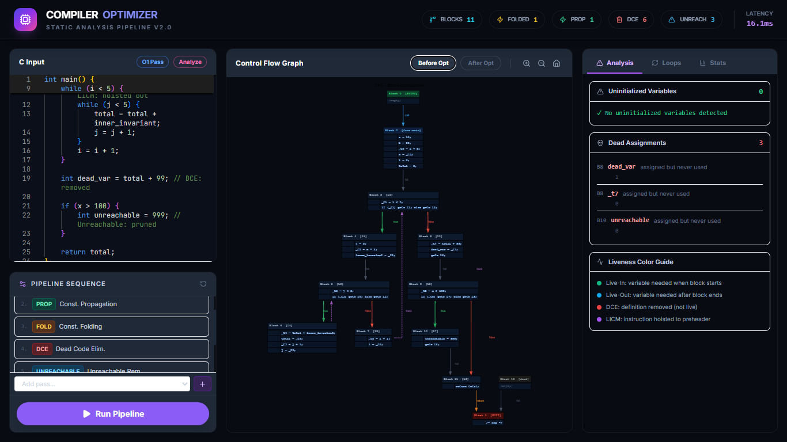

# OptiC - C Compiler Optimization Pipeline

OptiC is an educational C compiler static analysis and optimization visualizer. It takes standard C code, generates an Abstract Syntax Tree (AST) and Control Flow Graph (CFG), and applies various optimization passes, visualizing the impact of each transformation in a high-fidelity, interactive dashboard.
<div align="center">
  <!-- TODO: Place your 'dashboard.png' file in the same folder as this README -->
  
</div>

## ✨ Features
*   **Modular Optimization Pipeline:** Apply passes in any order to see how they cascade and interact.
    *   Constant Folding
    *   Constant Propagation
    *   Dead Code Elimination (Memory-aware)
    *   Unreachable Code Removal
    *   Loop Invariant Code Motion (LICM)
*   **Static Analysis Engine:** Performs Reaching Definitions and Live Variable Analysis to guarantee semantic safety.
*   **Interactive CFG Visualizer:** Pan, zoom, and inspect basic blocks. View before-and-after states of the CFG.
*   **Telemetry Dashboard:** Inspect specific blocks to see live-in/live-out sets, transformed instructions, and CFG edges.
*   **Optimization Analytics:** View statistical breakdowns of optimization impact (e.g., folded constants, pruned NOPs) powered by Recharts.

## 🛠️ Tech Stack
*   **Backend:** Python, Flask, NetworkX (Graph topology), pycparser (AST generation).
*   **Frontend:** Next.js (React), Tailwind CSS, Recharts, Monaco Editor.
*   **Visualization Engine:** Graphviz (via DOT string conversion).

## 🚀 Quick Start

### Prerequisites
*   Ubuntu/WSL or any Debian-based Linux environment.
*   Python 3.x
*   Node.js (v18+)

### 1. Clone the repository
```bash
git clone https://github.com/yourusername/OptiC.git
cd OptiC
```

### 2. Setup the environment
Run the setup script to automatically install Graphviz, set up the Python virtual environment, and install all Node/React modules.
```bash
chmod +x setup.sh start.sh
./setup.sh
```

### 3. Start the application
Run the start script to launch both the Flask backend and the Next.js frontend concurrently.
```bash
./start.sh
```
*Open your browser and navigate to `http://localhost:3000`.*

## 🧠 How it Works
1.  **Frontend Input:** C code is written in the Monaco Editor and sent to the Flask backend along with a chosen sequence of optimization passes.
2.  **AST Generation:** `pycparser` converts the C code into an Abstract Syntax Tree.
3.  **CFG Construction:** The AST is traversed to build a Three-Address Code (TAC) Control Flow Graph.
4.  **Static Analysis:** The CFG undergoes Reaching Definitions and Live Variable analysis.
5.  **Optimization:** The selected passes run iteratively until a fixed point is reached.
6.  **Visualization:** The optimized graph is converted to a DOT string, rendered into SVG by Graphviz, and sent back to the Next.js frontend for interactive display.
